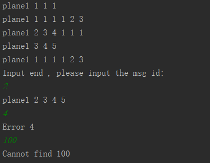
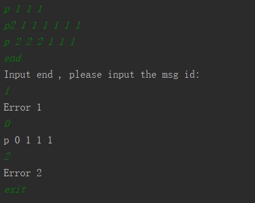
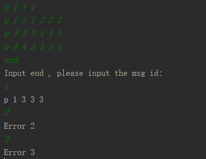

### UavQuestion程序描述说明

#### 程序概述

1. 程序代码语言

   Kotlin

2. 项目结构

   src包为代码存放位置，项目包结构为MVP结构，其中planeInfo.txt为homework指定测试用例文件

3. 程序启动

   程序启动文件为src包中的Start.kt，运行main方法，程序执行

#### 简单测试用例

1. 输入homework测试用例

   ​

   

   正确输出，测试成功

2. 输入的msg中id不同，为故障用例

   

   end为输入结束标志，第一条为正确输入，输入0时正确显示，第二条中id与第一行不同，应故障信息，当第二条为故障时，第三条也为故障，测试成功

3. 当前输入坐标（x,y,z）与前一个坐标(x,y,z,x',y',z')不匹配，为故障用例

   

   第一、二条输入正常，第三条为错误输入（应为"p 3 3 3 1 1 1"），则第四条也为故障信息，测试成功

#### 两种测试方法

​	Start.kt文件中有mView.inputUavInfo()与mView.inputUavInfoWithPath()方法分别为直接输入测试("end"为内容输入完成标志)和输入日志文件路径（测试用例日志文件路径: src/planeInfo.txt）测试(程序退出指令为"exit")